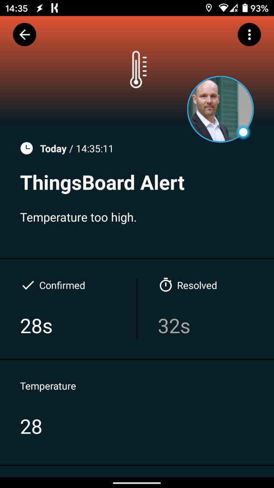
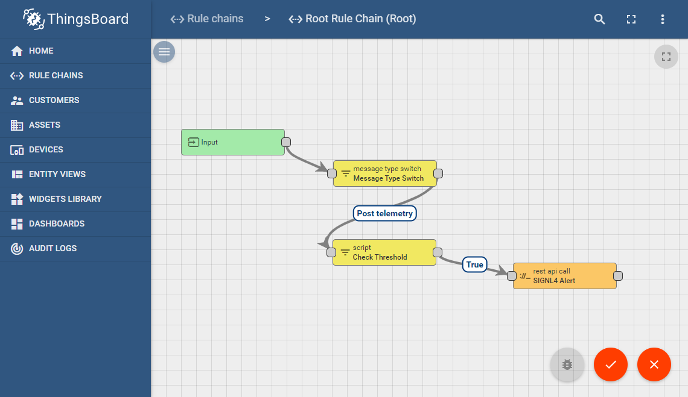
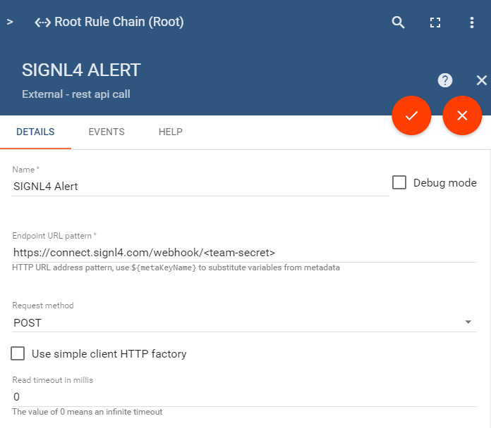

# Mobile Alarmierung per App, SMS und Anruf für ThnigsBoard

Mobile Alarmierung mit Tracking, Bereitschafts-Planung und Eskalation für ThnigsBoard.

## Warum SIGNL4

ThingsBoard ist eine Open-Source-IoT-Plattform für die Geräteverwaltung, Datensammlung, -verarbeitung und -visualisierung für Ihre IoT-Projekte. Sie ermöglicht die Konnektivität von Geräten über IoT-Protokolle nach Industriestandard, zum Beispiel MQTT, CoAP und HTTP und unterstützt sowohl Cloud- als auch On-Premise-Implementierungen. Das ThingsBoard kombiniert Skalierbarkeit, Fehlertoleranz und Leistung. Die Integration dieser leistungsstarken IoT-Plattform mit SIGNL4 kann Ihren täglichen Betrieb durch die zuverlässige Alarmierung mobiler Teams verbessern, egal wo sich diese befinden.
 


## So funktioniert es

Alles, was für die Verknüpfung von ThnigsBoard mit SIGNL4 nötig ist, ist ein REST API Call in Ihrem ThnigsBoard-Portal der in Ihrer Role Chain ausgelöst wird. Dies ermöglicht die Übertragung der Daten an SIGNL4 und somit die Alarmierung Ihres SIGNL4-Teams.

## Integration

- Alarmierung von Wartungsteams in SIGNL4 per mobilem Push, Text und Sprache
- Anbindung an SIGNL4 per Email (SMTP API)
- Transparente Quittierung in der mobilen App
- Eskalation von Alarmen wenn eine bestimmte Zeit verstrichen ist
- Team-Kommunikation innerhalb von Alarmen
- Nachvollziehbarkeit der Störungs-Behebung
- Integrierte Bereitschafts-Planung, um die richtigen Personen zur richtigen Zeit zu alarmieren
- Alarmierung über kritische IoT-Status
- Mögliche Zwei-Wege-Integration zur Interaktion mit Geräten

## Szenarien

- Industrielles IoT
- Industrie 4.0
- IoT Service Benachrichtigung
- IoT Geräte-Management
- Produktion, Versorgung, Öl und Gas, Landwirtschaft, etc.

## Und so funktioniert es

### Integration von SIGNL4 mit ThnigsBoard

In unserem Beispiel benutzen wir den ThnigsBoard unter Linux, und wir simulieren einen Temperatur-Sensor. Wenn die Temperatur zu hoch ist, senden wir einen Alarm an unser SIGNL4-Team.

SIGNL4 ist eine mobile App mit der Teams schneller und effektiver auf kritische Alarme, technische Störungen und dringende Service-Aufträge reagieren können. Holen Sie sich die App unter https://www.signl4.com.



### Voraussetzungen

Ein SIGNL4-Konto (https://www.signl4.com)

Eine ThingsBoard Installation (https://thingsboard.io)

#### Integrations-Schritte

1. Rule Chain anlegen 

Sie können ThingsBoard on-premise oder in der Cloud verwenden. In unserem Beispiel verwenden wir die On-Permise-Version und Sie finden die Installationsanleitungen hier:
https://thingsboard.io/docs/user-guide/install/installation-options/?ceInstallType=onPremise

In Ihrem ThingsBoard-Portal können Sie eine neue Rule Chain erstellen oder die Root Chain bearbeiten.

2. REST API Call hinzufügen  

Fügen Sie den Node REST API Call zu Ihrer Rule Chain hinzu. Diese sendet den HTTP Post Request an SIGNL4. Die URL ist Ihre SIGNL4 Webhook URL zusammen mit Ihrem Team-Geheimnis. Der Body sind die msg.payload Daten aus dem vorherigen Schritt.



Diese Node können Sie nun dort verwenden, wo Sie einen Alarm senden möchten. In unserem Fall benutzen wir ein Daten von einem Device, die wir noch nach bestimmten Kriterien untersuchen (Temperatur zu hoch). 

3. Testen  

Um den Aufbau zu testen, können wir ein Geräteereignis simulieren. Wenn Sie kein echtes Gerät angeschlossen haben, können Sie dies mit einem solchen Kommandozeilenaufruf simulieren:

```
curl -v -X POST -d "{\"title\": \"ThingsBoard-Alarm\", \"Nachricht\": \"Temperatur zu hoch.\", \"Temperatur\": 28}" http://localhost:8080/api/v1/A1_TEST_TOKEN/telemetry --Überschrift "Content-Type:application/json": \"Content-Type:application/json
```

Eine genauere Beschreibung der verschiedenen Curl-Befehle finden Sie hier:
https://thingsboard.io/docs/getting-started-guides/helloworld/

Das ist es. Sie können nun Ihr IoT-Szenario testen, indem Sie die Temperaturänderung simulieren. Sie erhalten dann einen Alarm in Ihrer SIGNL4 App.

Ein Beispiel finden Sie auf in GitHub:
https://github.com/signl4/signl4-integration-thingsboard
