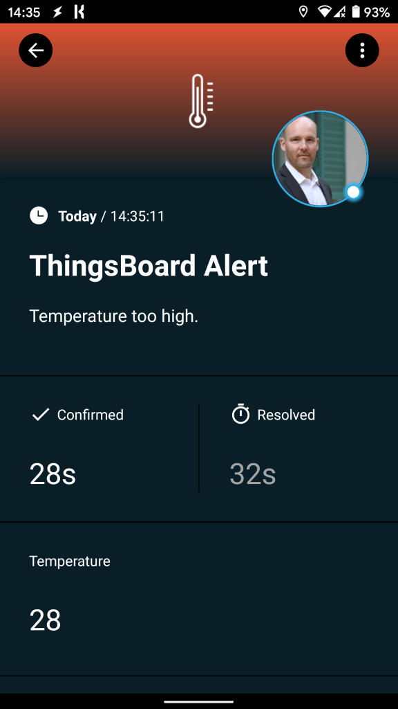
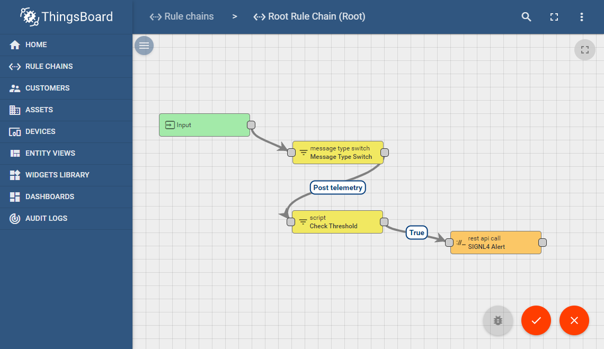
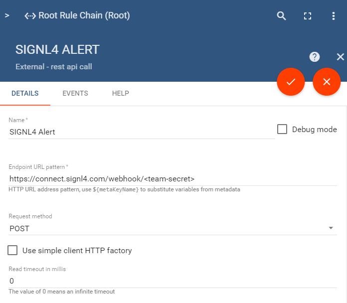

# Mobile alerting with tracking & escalation for ThnigsBoard

Mobile alerting with tracking, duty planning and escalation for ThnigsBoard.

## Why SIGNL4

ThingsBoard is an open-source IoT platform for device management, data collection, processing and visualization for your IoT projects. It enables device connectivity via industry standard IoT protocols, e.g. MQTT, CoAP and HTTP and supports both cloud and on-premises deployments. ThingsBoard combines scalability, fault-tolerance and performance. Pairing this powerful IoT platform with SIGNL4 can enhance your daily operations with an extension to your team on the shop floor or in the field.



## How it Works

All it takes to pair ThnigsBoard and SIGNL4 is a REST API Call in your ThnigsBoard platform that is triggered each time a relevant event appears. This will send the respective data to SIGNL4 and thus to alert the responsible team.

## Integration Capabilities

- Service engineers alerted via mobile push, text and voice
- Integration with SIGNL4 via webhook or email (SMTP)
- Staff can acknowledge and take ownership for critical events that occur
- Alerts are escalated in case of no response
- Communicate within an alert to address a particular problem
- Tracking and visibility of problem solutions
- Integrated on-call duty planning
- Alert on critical IoT device states
- Two-way integration to interact or set the device state

## Scenarios

- Industrial IoT
- Industry 4.0
- IoT Service Alerting
- IoT Device Management
- IT, Manufacturing, Utility, Oil and Gas, Agriculture, etc.

## How To Integrate

### Integrating SIGNL4 with ThnigsBoard

In our example we ThingsBoard installed on Linux and we simulate a temperature alert. When the temperature is too high we send an alert to our SIGNL4 team.

SIGNL4 is a mobile alert notification app for powerful alerting, alert management and mobile assignment of work items. Get the app at https://www.signl4.com.



### Prerequisites

A SIGNL4 account (https://www.signl4.com)

An ThnigsBoard installation (https://thingsboard.io)

#### Integration Steps

1. Create a Rule Chain 

You can use ThingsBoard on-premise or in the cloud. In our example we use the on-permise version and you can find the installation instructions here:
https://thingsboard.io/docs/user-guide/install/installation-options/?ceInstallType=onPremise

In your ThingsBoard portal you can create a new Rule Cain or edit the Root Chain.

2. Add the REST API Call  

Add the Node REST API Call to your Rule Chain. This one sends the HTTP Post request to SIGNL4. The URL is your SIGNL4 webhook URL along with your team secret. The Body is the msg.payload data from the previous step.



You can now connect this node where you want to send an alarm. In our case we use a data from a device which we are still examining according to certain criteria (temperature too high).

3. Test It  

In order to test the setup we can simulate a device event. If you do not have a real device connected you can simulate this with a command line call like this:

```
curl -v -X POST -d "{\"title\": \"ThingsBoard Alert\", \"message\": \"Temperature too high.\", \"temperature\": 28}" http://localhost:8080/api/v1/A1_TEST_TOKEN/telemetry --header "Content-Type:application/json"
```

You can find a more detailed description about the different curl commands here:
https://thingsboard.io/docs/getting-started-guides/helloworld/

This is it. You can now test your IoT scenario by simulating the temperature change. You will then receive an alert in your SIGNL4 app.

You can find a sample in GitHub:
https://github.com/signl4/signl4-integration-thingsboard
